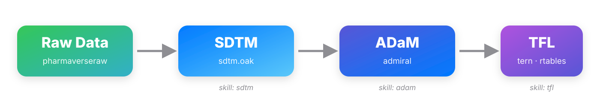

## 今天的旅程

**目标**：不用从零学 R，用 **Claude Code + skill**，用自然语言驱动生成符合 CDISC 规范的临床数据集。

{width="80%" fig-align="center" fig-alt="从原始数据到 SDTM 到 ADaM 到 TFL 的流水线"}

**两个课时**：课时 1 = Claude Code 上手 + 生成 **SDTM**；课时 2 = 生成 **ADaM** + **TFL**

## 我们用什么工具

| 工具 | 用途 |
|------|------|
| **Claude Code** | 终端里的 AI 编程助手，用中文对话驱动写代码 |
| **skill** | 本项目内置的领域技能包，自动按 CDISC 规范生成代码 |
| **pharmaverse** | 开源临床数据生态（sdtm.oak / admiral / tern） |
| **CDISCPILOT01** | pharmaverse 内置的公开示例研究数据 |

::: {.callout-note}
本项目内置 **十余个 skill**：教学层（`sdtm`、`sdtm-map`、`adam`、`adam-derive`、`tfl` 等，中文）
+ 官方参考层（`admiral` 家族、`sdtm-oak`，来自 R Consortium pharma-skills）。
用自然语言描述需求，对应 skill 自动加载，按 CDISC 标准生成可运行代码。
:::

## 什么是 CDISC

**CDISC**：临床数据交换标准协会制定的**数据标准体系**。监管机构（FDA/EMA）要求
提交的临床试验数据遵循统一格式 —— 不标准的数据无法评审。

**数据流水线的四个层次**：

| 层次 | 是什么 | 例子 |
|------|--------|------|
| **原始数据（EDC）** | 医院/研究中心采集的病例数据 | "Recovered/Resolved"、"Mild" |
| **SDTM** | 整理成规范表格式的原始数据 | 大写 + 受控术语（AESEV="MILD"） |
| **ADaM** | 可直接统计分析的分析数据集 | 生存时间、治疗期标志 |
| **TFL** | 报告交付物：表格/图/清单 | 人口学表、KM 曲线 |

**CDISCPILOT01**：CDISC 官方发布的示例研究数据（pharmaverse 内置），本课全程使用。

# 课时 1：用 Claude Code 生成 SDTM {.center}

*Claude Code 上手 + SDTM 映射 · 60 分钟*

## 先学会用 Claude Code

**Claude Code**：终端里的 AI 编程助手。你用中文说需求，它读代码、写代码、跑代码、看报错再改。

**不懂 R 也能上手，三件事**：

1. **对话驱动** —— 直接用中文说要干什么，AI 生成/修改 `.R` 脚本，你审阅后运行
2. **skill 触发** —— 说到领域关键词（如"生成 DM 域"），对应 skill 自动加载，按 CDISC 规范写代码
3. **看懂 + 迭代** —— AI 生成的代码有中文注释；不满意就继续说"把 X 改成 Y"

::: {.callout-tip}
你不用记 R 语法。你要做的是**说清楚要什么**（哪个域、什么变量、什么规则），
再**看懂 AI 在做什么**，让它反复改到对。
:::

## Claude Code 基础操作

第一次用终端 AI？先记住这几个界面操作：

| 操作 | 怎么做 |
|------|--------|
| **启动** | 终端输 `claude` 回车 |
| **对话** | 直接打字 + 回车 |
| **引用文件** | `@sdtm/dm.R`（让 AI 读某个文件再干活） |
| **中断生成** | `ESC`（AI 跑偏了打断，**不退出**） |
| **退出 CLI** | `ctrl + C` 按两次 |
| **接受 / 拒绝改动** | AI 改文件会问，`y` 确认、`n` 拒绝 |
| **清空重来 / 求助** | `/clear` 清上下文 · `/help` 看帮助 |

::: {.callout-note}
分两天做没做完？下次进终端输 `claude --resume` 恢复上次对话，接着往下做。
:::

## Claude Code 五个实用动作

课时里你会反复用到这五个动作：

| 动作 | 你怎么说 | 场景 |
|------|---------|------|
| **① 对话生成** | "帮我生成 DM 域的 SDTM 映射代码" | 从零起一个脚本 |
| **② 显式喊 skill** | "用 sdtm-map skill 做 VS 域" | 关键词没自动触发时 |
| **③ 文件引用** | "参考 `sdtm/dm.R` 帮我写 `vs.R`" | 让 AI 照已有脚本仿写 |
| **④ 迭代修改** | "把导出路径改成 output 目录" | 生成后继续调 |
| **⑤ 解释 + 排错** | "解释这段 `assign_ct`" / "跑报错了，帮我修" | 看懂代码、AI 读报错自动 debug |

::: {.callout-note}
本课时全程只用这五个动作 —— 不用手写 R，不碰 MCP/hooks 等进阶功能。
:::

## 什么是 SDTM

**SDTM**（Study Data Tabulation Model）：把 EDC 采集的**原始数据**，按 CDISC 规定
**重命名、标准化**成监管提交用的规范格式。数据按**域（Domain）**组织：DM / VS / AE……

**三种映射动作**（sdtm.oak）：

| 动作 | 作用 | 例子 |
|------|------|------|
| `assign_no_ct` | 原样复制 | 年龄 "64" → AGE="64" |
| `assign_ct` | 按受控术语表转换 | "Mild Adverse Event" → AESEV="MILD" |
| `hardcode_ct` | 写固定常量 | 每行 DOMAIN="AE" |

接下来两页看**真实数据**：原始采集 vs 映射后的 SDTM。

## 原始采集数据长什么样

`pharmaverseraw::ae_raw` —— 字段名与取值保持 EDC 采集的原始形态（如 "Mild Adverse Event"）：

```{r}
#| eval: TRUE
#| echo: FALSE
#| message: FALSE
library(reactable); library(dplyr)
ae_raw <- pharmaverseraw::ae_raw
reactable::reactable(
  head(ae_raw, 5) |> dplyr::select("STUDY", "PATNUM", "IT.AETERM", "IT.AESEV", "AEOUTCOME"),
  height = 320, highlight = TRUE, defaultColDef = reactable::colDef(style = list(fontSize = "12px"))
)
```

::: {.callout-note}
注意取值："Mild Adverse Event"、"Recovered/Resolved" —— **半自然语言**，不是标准码。
:::

## SDTM 标准数据长什么样

同一批数据，映射成 `pharmaversesdtm::ae` 之后 —— **统一大写 + 受控术语**：

```{r}
#| eval: TRUE
#| echo: FALSE
#| message: FALSE
ae <- pharmaversesdtm::ae
reactable::reactable(
  head(ae, 5) |> dplyr::select("STUDYID", "USUBJID", "AESEQ", "AEDECOD", "AESEV", "AEOUT"),
  columns = list(
    STUDYID = reactable::colDef(header = "研究"),
    USUBJID = reactable::colDef(header = "受试者编号"),
    AESEQ   = reactable::colDef(header = "序号"),
    AEDECOD = reactable::colDef(header = "不良事件（标准术语）"),
    AESEV   = reactable::colDef(header = "严重程度（标准值）"),
    AEOUT   = reactable::colDef(header = "结局（标准值）")
  ),
  height = 320, highlight = TRUE, defaultColDef = reactable::colDef(style = list(fontSize = "12px"))
)
```

::: {.callout-tip}
对比上一页：同一件事，"Mild Adverse Event" → `AESEV = "MILD"` —— 这就是 `assign_ct` 干的事。
:::

## 课堂演示：生成 DM 域（最基础的域）

**DM（人口学）**：每个受试者一行，含年龄/性别/种族等基本信息 —— 最简单的域，适合第一个上手。

在 Claude Code 中输入需求：

> "帮我用 sdtm.oak 生成 DM 域的映射代码，原始数据是 pharmaverseraw 的 dm_raw"

`sdtm-map` skill 自动加载（触发词：`DM域`、`生成SDTM`、`sdtm.oak`），生成映射脚本：

```r
dm <- dm_raw %>%
  generate_oak_id_vars(pat_var = "PATNUM", raw_src = "dm_raw") %>%
  assign_no_ct(raw_dat = dm_raw, raw_var = "IT.AGE", tgt_var = "AGE",
               id_vars = oak_id_vars()) %>%          # 年龄：原样复制
  assign_ct(raw_dat = dm_raw, raw_var = "IT.SEX", tgt_var = "SEX",
            ct_spec = study_ct, ct_clst = "C66731",
            id_vars = oak_id_vars()) %>%              # 性别：按 CT 表转换
  hardcode_ct(tgt_var = "DOMAIN", value = "DM",
              id_vars = oak_id_vars())                # 域代码：固定值
```

## 运行与产物

```r
source("sdtm/dm.R")   # 生成 DM 域，导出 dm.xpt
```

**产物**：符合 SDTM 规范的 DM 数据集（每人一行：STUDYID / USUBJID / AGE / SEX / RACE / ARM…），
导出为 `dm.xpt`（SAS 传输文件）到 `sdtm/output/`。

查看产物：

```r
haven::read_xpt("sdtm/output/dm.xpt") |> head()
# 或打开交互展示 app："SDTM DM 数据" 模块
```

::: {.callout-important}
**踩坑：受控术语表要齐**。`assign_ct` 用的 codelist（如 `C66731` 性别）必须在
`metadata/sdtm_ct.csv` 里有对应条目，否则报 `ct_clst must be equal to one of…`。
本项目的 CT 表已按 NCI-EVS 官方值补全。
:::

## 动手练习：生成 VS 域 {background-opacity="0.04"}

**目标**：仿照 DM，生成 VS（生命体征）域 —— 难度中等：多个指标 + 单位换算。

```r
library(sdtm.oak); library(pharmaverseraw); library(dplyr)

vs_raw <- pharmaverseraw::vs_raw
study_ct <- read.csv("metadata/sdtm_ct.csv")

vs <- vs_raw %>%
  generate_oak_id_vars(pat_var = "PATNUM", raw_src = "vs_raw") %>%
  # TODO 1: 映射 VSTESTCD（原始 IT.VSTESTCD → 目标 VSTESTCD，用 assign_no_ct）
  # 👉 在这里补一段 assign_no_ct(...)
  # TODO 2: 映射 VSTEST（原始 IT.VSTEST → 目标 VSTEST，用 assign_no_ct）
  # 👉 在这里补一段 assign_no_ct(...)
  identity()
```

::: {.callout-tip}
不会写就问 Claude Code："帮我补全这两个 TODO"。完整答案见 `sdtm/vs.R`。
:::

## 进阶：生成 AE 域（复杂域）

**AE（不良事件）**：记录每个受试者发生的不良事件 —— 最复杂的域之一：
多个 CT 映射（结局/严重程度/相关性）+ 关联 DM 的参照日期 + 研究日计算。

```r
ae <- ae_raw %>%
  generate_oak_id_vars(pat_var = "PATNUM", raw_src = "ae_raw") %>%
  assign_ct(raw_dat = ae_raw, raw_var = "AEOUTCOME", tgt_var = "AEOUT",
            ct_spec = study_ct, ct_clst = "C66768", id_vars = oak_id_vars()) %>%
  assign_ct(raw_dat = ae_raw, raw_var = "IT.AESEV", tgt_var = "AESEV",
            ct_spec = study_ct, ct_clst = "C66769", id_vars = oak_id_vars()) %>%
  derive_vars_dtm(dtc = "AEDTC")          # ISO 8601 日期解析
```

::: {.callout-note}
完整实现见 `sdtm/ae.R`（含 SUPPAE 补充域处理）。先把 DM 和 VS 练熟，
再挑战这个域。
:::

## 课时 1 小结

- **Claude Code 五个动作**：对话生成 / 喊 skill / 文件引用 / 迭代改 / 解释排错
- **sdtm / sdtm-map skill**：回答 SDTM 结构问题 + 生成映射代码
- **三种映射动作**：`assign_no_ct` / `assign_ct` / `hardcode_ct`
- **难度递进**：DM（基础）→ VS（单位换算）→ AE（多 CT + 日期）

**练习**：完成 VS 域后，进阶挑战 AE 域。

# 课时 2：用 Claude Code 生成 ADaM + TFL {.center}

*分析数据集 + 表格图形 · 60 分钟*

## 什么是 ADaM

**ADaM**（Analysis Data Model）：在 SDTM 基础上进一步加工成**可直接统计分析**的数据集。

先看真实 ADSL 数据（每个受试者一行）：

```{r}
#| eval: TRUE
#| echo: FALSE
#| message: FALSE
adsl <- pharmaverseadam::adsl
reactable::reactable(
  head(adsl, 5) |> dplyr::select("USUBJID", "AGE", "SEX", "RACE", "ACTARM", "SAFFL"),
  columns = list(
    USUBJID = reactable::colDef(header = "受试者编号"),
    AGE     = reactable::colDef(header = "年龄"),
    SEX     = reactable::colDef(header = "性别"),
    RACE    = reactable::colDef(header = "种族"),
    ACTARM  = reactable::colDef(header = "实际治疗组"),
    SAFFL   = reactable::colDef(header = "安全性人群")
  ),
  height = 300, highlight = TRUE, defaultColDef = reactable::colDef(style = list(fontSize = "12px"))
)
```

- **ADSL** —— 受试者级数据集（每人一行），所有 ADaM 的基础
- **两种结构**：
  - **BDS**（Basic Data Structure）：参数化长表，如 `ADVS` / `ADLB` / `ADTTE`
  - **OCCDS**（Occurrence Data Structure）：发生类事件，如 `ADAE` / `ADCM`

**admiral** 提供 `derive_*` 系列派生函数，一个函数做一件事，串成管道。

## 课堂演示：生成 ADSL → ADAE

先建 ADSL（基础），再建其他 ADaM（都要合并 ADSL 的受试者级变量）。

:::: {.columns}

::: {.column width="50%"}
**SDTM 输入**

```r
# AE 域：不良事件记录
ae   <- pharmaversesdtm::ae
# DM 域：人口学 + 治疗日期
dm   <- pharmaversesdtm::dm
```

在 Claude Code 中输入：

> "生成 ADAE，需要标记 TRTEMFL（治疗期间不良事件标志）"
:::

::: {.column width="50%"}
**admiral 派生 → ADAE**

```r
adae <- ae %>%
  derive_vars_merged(     # 合并治疗日期
    dataset_add = dm,
    new_vars = exprs(TRTSDT, TRTEDT),
    by_vars = exprs(STUDYID, USUBJID)
  ) %>%
  derive_vars_dt("AST", dtc = AESTDTC) %>%
  derive_var_trtemfl(new_var = TRTEMFL)
```
:::

::::

## 从 ADaM 到 TFL：Layout 与 Data 分离

**TFL**（Tables / Figures / Listings）：临床报告最终交付物。技术栈 `rtables`（布局）+ `tern`（临床封装，主要调这层）。

:::: {.columns}

::: {.column width="50%"}
**① 先声明布局（还没数据）**

```r
lyt <- basic_table(show_colcounts = TRUE) %>%
  split_cols_by("ACTARM") %>%   # 按治疗组分列
  add_overall_col("All Patients") %>%
  analyze_vars(c("AGE", "SEX", "RACE"))
```
:::

::: {.column width="50%"}
**② 再喂数据，生成表**

```r
tbl <- build_table(lyt, df = adsl)
```

**核心心智模型**：结构和内容解耦 —— 先说"表长什么样"，再喂数据。
和 SDTM/ADaM 的规范化思路一致。
:::

::::

## TFL 三个示例

**说一句话，`tfl` skill 生成对应代码**：

| 你说 | 生成 | 难度 |
|------|------|------|
| "做人口学特征表，按治疗组分列" | `t_demographic.R` | 入门（ADSL 单表） |
| "AE 汇总表，按 SOC 和 PT 统计发生率" | `t_adverse_events.R` | 中级（ADAE+ADSL 分母） |
| "画总生存期 OS 的 KM 生存曲线" | `g_km.R` | 进阶（表→图） |

**下面的三张产物都是真实运行结果**（`rtables::as_html` 直接渲染，不是示意图）：

## 产物 1：人口学特征表

```{r}
#| eval: TRUE
#| echo: FALSE
#| message: FALSE
library(rtables); library(tern); library(dplyr)
adsl <- pharmaverseadam::adsl %>%
  filter(SAFFL == "Y") %>%
  mutate(SEX = factor(SEX, levels = c("F", "M"), labels = c("Female", "Male")))
lyt <- basic_table(show_colcounts = TRUE) %>%
  split_cols_by("ACTARM") %>%
  add_overall_col("All Patients") %>%
  analyze_vars(vars = c("AGE", "SEX"), .stats = c("n", "mean_sd", "count_fraction"))
rtables::as_html(build_table(lyt, df = adsl))
```

**一段 layout + `build_table()` 就出这张规范表** —— tern 自动算好统计量和百分比。

## 产物 2：AE 汇总表（分子分母分离）

```{r}
#| eval: TRUE
#| echo: FALSE
#| message: FALSE
adae <- pharmaverseadam::adae
adsl2 <- pharmaverseadam::adsl %>% filter(SAFFL == "Y") %>%
  mutate(ACTARM = factor(ACTARM))
adae2 <- adae %>% filter(TRTEMFL == "Y") %>%
  mutate(ACTARM = factor(ACTARM, levels = levels(adsl2$ACTARM)))
lyt2 <- basic_table(show_colcounts = TRUE) %>%
  split_cols_by("ACTARM") %>%
  summarize_num_patients(var = "USUBJID", .stats = "unique",
                         .labels = c(unique = "Subjects with at least one AE")) %>%
  split_rows_by("AEBODSYS", child_labels = "visible", nested = FALSE, indent_mod = -1L) %>%
  count_occurrences(vars = "AEDECOD")
tbl_ae <- build_table(lyt2, df = adae2, alt_counts_df = adsl2) %>%
  prune_table() %>%
  sort_at_path(path = c("AEBODSYS", "*", "AEDECOD"), scorefun = score_occurrences)
rtables::as_html(head(tbl_ae, 8))
```

::: {.callout-important}
**AE 表分母口诀：分子看 ADAE，分母看 ADSL。**

ADAE 里**只有发生过 AE 的人**，没发生的不在里面。
所以百分比分母（每组总人数 N）必须单独从 ADSL 传：

```r
build_table(lyt, df = adae, alt_counts_df = adsl)  # ← 分母
```

漏了它 → 分母用 ADAE 人数 → 百分比虚高。
:::

## 产物 3：KM 生存曲线图

```{r}
#| eval: TRUE
#| echo: FALSE
#| message: FALSE
adtte <- pharmaverseadam::adtte_onco %>%
  filter(PARAMCD == "OS") %>%
  mutate(ARM = factor(ARM), is_event = (CNSR == 0))
tern::g_km(
  df = adtte,
  variables = list(tte = "AVAL", is_event = "is_event", arm = "ARM"),
  annot_surv_med = TRUE,
  title = "Kaplan-Meier Plot of Overall Survival",
  xlab = "Time (Days)", ylab = "Survival Probability"
)
```

`tern::g_km()` 返回 **ggplot 对象**，幻灯片里直接渲染 —— 与 `tfl/g_km.R` 完全同源。

## 动手练习：改成 PFS 曲线 {background-opacity="0.04"}

**目标**：把 KM 图从总生存（OS）改成无进展生存（PFS）。

```r
library(tern); library(dplyr); library(ggplot2)

anl <- pharmaverseadam::adtte_onco %>%
  # TODO 1: 把 PARAMCD 从 "OS" 改成 "PFS"
  filter(PARAMCD == "OS") %>%              # 👉 改这里
  mutate(ARM = factor(ARM), is_event = (CNSR == 0))

g_km(anl,
     variables = list(tte = "AVAL", is_event = "is_event", arm = "ARM"),
     annot_surv_med = TRUE,
     # TODO 2: 把标题改成 "Progression-Free Survival"
     title = "Overall Survival")               # 👉 改这里
```

::: {.callout-tip}
`adtte_onco` 里 `PARAMCD` 有 `OS` / `PFS` 两个终点，换一个值就换一条曲线。
:::

## 常见踩坑集合

| 坑 | 症状 | 解法 |
|----|------|------|
| **CT 表缺 codelist** | `ct_clst must be equal to one of…` | 按 NCI-EVS 官方值补 `sdtm_ct.csv` |
| **AE 表漏分母** | 百分比虚高 | `build_table(…, alt_counts_df = adsl)` |
| **分组变量没因子化** | 少一列/顺序乱 | `factor(ACTARM, levels = …)` 对齐分子分母 |
| **日期没走 admiral 函数** | 部分日期静默变 NA | 用 `derive_vars_dt()`，别直接 `as.Date()` |

::: {.callout-tip}
遇到没见过的表/图，查官方 **TLG Catalog**（数百个即用示例）：
`insightsengineering.github.io/tlg-catalog`
:::

## 完整链条回顾 {.center}

{width="92%" fig-alt="原始数据 → SDTM → ADaM → TFL 流水线，每段对应一个 skill"}

**每一段都有对应 skill**：`sdtm` → `adam` → `tfl`，全程中文对话驱动。

## 下一步：交互展示

数据和 TFL 都有了 —— 想让它们**可交互探索**（动态筛选、切换参数）？

**pharmaverse 的 `teal` 框架**：把 tern/rtables 的输出包装成 Shiny 交互应用。
本仓库已实现一个完整示例（`app/app.R`）：数据浏览 + 三张 TFL 的交互版。

::: {.callout-note}
teal 交互展示属于 **Shiny 进阶主题**（详见 shiny_training 培训），本次不展开。
本次培训到"生成分析就绪的数据 + 静态 TFL"为止 —— 这已是电子提交的核心产出。
:::

## 扩展：官方 pharma-skills 生态 {.smaller}

本项目的 skill 之外，R Consortium 维护官方 **pharma-skills** 仓库：
<https://github.com/RConsortium/pharma-skills>

- 生产级 skill 家族：`admiral`（ADaM）、`sdtm-oak`（SDTM）等
- 本仓库已内置完整副本（`.claude/skills/admiral/`、`.claude/skills/sdtm-oak/`）
- 想深究规范细节（日期规则、flag 约定、函数选择）时，直接问 Claude，它会引用官方依据

::: {.callout-note}
扩展内容，本次不展开 —— 供想了解生产级规范的同学课后探索。
:::

## 谢谢 {.center}

**项目仓库**：<https://github.com/kaipingyang/CDISC_training>

**跟着做**：

```r
renv::restore()                # 恢复环境
source("sdtm/dm.R")            # SDTM：从最基础的 DM 域开始
source("adam/adsl.R")          # ADaM
source("tfl/t_demographic.R")  # TFL
```

**或者，直接在 Claude Code 里用中文说出你要的数据集。**
