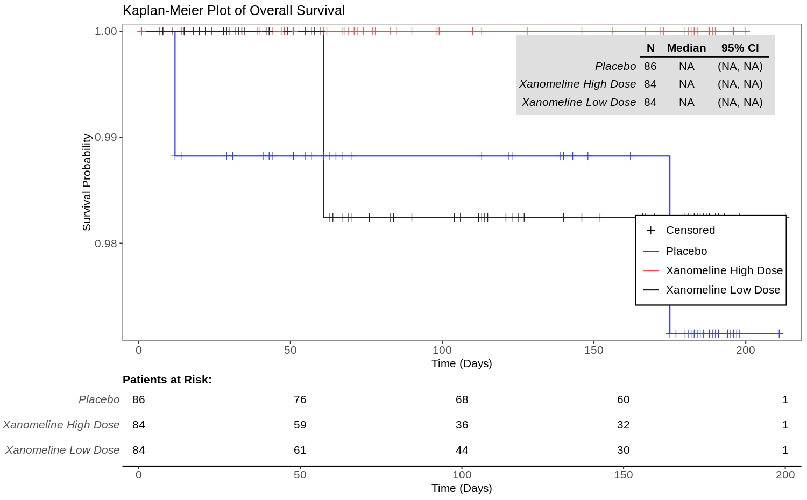

## 今天的旅程 {.center}

**目标**：不用从零学 R，用 **Claude Code + skill**，用自然语言驱动生成符合 CDISC 规范的临床数据集。

{width="92%" fig-alt="从原始数据到 SDTM 到 ADaM 到 TFL 的流水线"}

**两个课时**：课时 1 = Claude Code 基础 + 生成 **SDTM**；课时 2 = 生成 **ADaM** + **TFL**

## 我们用什么工具

| 工具 | 用途 |
|------|------|
| **Claude Code** | 终端里的 AI 编程助手，用中文对话驱动写代码 |
| **skill** | 本项目内置的领域技能包，自动按 CDISC 规范生成代码 |
| **pharmaverse** | 开源临床数据生态（sdtm.oak / admiral / tern） |
| **CDISCPILOT01** | pharmaverse 内置的公开示例研究数据 |

::: {.callout-note}
本项目内置 **7 个 skill**：`sdtm`、`sdtm-map`、`adam`、`adam-derive`、`admiral-adsl`、`admiral-bds`、`tfl`。
用自然语言描述需求，对应 skill 自动加载，按 CDISC 标准生成可运行代码。
:::

## Claude Code 怎么用 {.center}

**三件事就够上手**：

1. **对话驱动** —— 直接用中文说要干什么，AI 读代码、改代码、跑代码
2. **skill 触发** —— 说到领域关键词（如"生成 AE 域"），对应 skill 自动加载
3. **文件读写** —— AI 直接在项目里创建/修改 `.R` 脚本，你审阅后运行

::: {.callout-tip}
你不需要记 R 语法。你需要的是**说清楚要什么**（哪个域、什么变量、什么规则），
再**看懂 AI 生成的代码在做什么**（有中文注释引导）。
:::

# 课时 1：用 skill 生成 SDTM {.center}

*Claude Code 基础 + SDTM 映射 · 60 分钟*

## 什么是 SDTM

**SDTM**（Study Data Tabulation Model）：把 EDC 采集的**原始数据**，按 CDISC 规定
**重命名、标准化**成监管提交用的规范格式。数据按**域（Domain）**组织：DM / AE / VS……

:::: {.columns}

::: {.column width="50%"}
**原始采集数据（EDC）**

```r
# ae_raw：字段名和取值都是"人话"
AEOUTCOME = "Recovered/Resolved"
IT.AESEV  = "Mild Adverse Event"
IT.AEREL  = "Probably Related"
```
:::

::: {.column width="50%"}
**SDTM 标准数据**

```r
# 重命名 + 受控术语(CT)标准化
AEOUT = "RECOVERED/RESOLVED"
AESEV = "MILD"
AEREL = "PROBABLY RELATED"
```
:::

::::

**三种映射动作**（sdtm.oak）：`assign_no_ct`（原样复制）· `assign_ct`（按 CT 表转换）· `hardcode_ct`（写固定常量）

## 主线演示：生成 AE 域

**在 Claude Code 里，你只需要说**：

> "帮我用 sdtm.oak 生成 AE 域的映射代码，原始数据是 pharmaverseraw 的 ae_raw"

`sdtm-map` skill 自动加载（触发词：`AE域`、`生成SDTM`、`sdtm.oak`），生成映射脚本：

```r
ae <- ae %>%
  # 映射不良事件结局 AEOUT（按 CT 表转换）
  assign_ct(
    raw_dat = ae_raw, raw_var = "AEOUTCOME", tgt_var = "AEOUT",
    ct_spec = study_ct, ct_clst = "C66768", id_vars = oak_id_vars()
  ) %>%
  # 映射严重程度 AESEV
  assign_ct(
    raw_dat = ae_raw, raw_var = "IT.AESEV", tgt_var = "AESEV",
    ct_spec = study_ct, ct_clst = "C66769", id_vars = oak_id_vars()
  )
```

## 运行与产物

```r
source("sdtm/ae.R")   # 生成 AE 域，导出 ae.xpt
```

**产物**：符合 SDTM 规范的 AE 数据集（STUDYID / USUBJID / AESEQ / AETERM / AESEV / AEOUT…），
导出为 `ae.xpt`（SAS 传输文件，供电子提交）。

::: {.callout-important}
**踩坑：受控术语表要齐**。`assign_ct` 用的 codelist（如 `C66769` 严重程度）必须在
`metadata/sdtm_ct.csv` 里有对应条目，否则报 `ct_clst must be equal to one of…`。
本项目的 CT 表已按 NCI-EVS 官方值补全 AE/VS 所需 codelist。
:::

## 动手练习：生成 DM 域 {background-opacity="0.04"}

**目标**：仿照 AE，用 skill 生成 DM（人口学）域。

```r
library(sdtm.oak); library(pharmaverseraw); library(dplyr)

dm_raw <- pharmaverseraw::dm_raw
study_ct <- read.csv("metadata/sdtm_ct.csv")

dm <- dm_raw %>%
  generate_oak_id_vars(pat_var = "PATNUM", raw_src = "dm_raw") %>%
  # TODO 1: 映射 SEX（原始 IT.SEX → 目标 SEX，用 assign_ct，codelist "C66731"）
  # 👉 在这里补一段 assign_ct(...)
  # TODO 2: 映射 AGE（原始 IT.AGE → 目标 AGE，无需 CT，用 assign_no_ct）
  # 👉 在这里补一段 assign_no_ct(...)
  identity()
```

::: {.callout-tip}
不会写就问 Claude Code："帮我补全这两个 TODO"。完整答案见 `sdtm/dm.R`。
:::

## 课时 1 小结

- **Claude Code**：中文对话驱动，skill 自动加载
- **sdtm / sdtm-map skill**：回答 SDTM 结构问题 + 生成映射代码
- **三种映射动作**：`assign_no_ct` / `assign_ct` / `hardcode_ct`
- **产物**：`AE.xpt` / `DM.xpt` / `VS.xpt`

**练习**：用同样方式生成 DM 域和 VS 域。

# 课时 2：用 skill 生成 ADaM + TFL {.center}

*分析数据集 + 表格图形 · 60 分钟*

## 什么是 ADaM

**ADaM**（Analysis Data Model）：在 SDTM 基础上进一步加工成**可直接统计分析**的数据集。

- **ADSL** —— 受试者级数据集（每人一行），所有 ADaM 的基础
- **两种结构**：
  - **BDS**（Basic Data Structure）：参数化长表，如 `ADVS` / `ADLB` / `ADTTE`
  - **OCCDS**（Occurrence Data Structure）：发生类事件，如 `ADAE` / `ADCM`

**admiral** 提供 `derive_*` 系列派生函数，一个函数做一件事，串成管道。

## 主线演示：生成 ADSL → ADAE

先建 ADSL（基础），再建其他 ADaM（都要合并 ADSL 的受试者级变量）。

:::: {.columns}

::: {.column width="50%"}
**SDTM 输入**

```r
# AE 域：不良事件记录
ae   <- pharmaversesdtm::ae
# ADSL：受试者级(治疗日期)
adsl <- pharmaverseadam::adsl
```

> "生成 ADAE，需要标记 TRTEMFL
> （治疗期间不良事件标志）"
:::

::: {.column width="50%"}
**admiral 派生 → ADAE**

```r
adae <- ae %>%
  derive_vars_merged(     # 合并治疗日期
    dataset_add = adsl,
    new_vars = exprs(TRTSDT, TRTEDT),
    by_vars = exprs(STUDYID, USUBJID)
  ) %>%
  derive_vars_dt("AST", dtc = AESTDTC) %>%
  derive_var_trtemfl(new_var = TRTEMFL)
```
:::

::::

## 从 ADaM 到 TFL：Layout 与 Data 分离

**TFL**（Tables / Figures / Listings）：临床报告最终交付物。技术栈 `rtables`（布局）+ `tern`（临床封装，主要调这层）。

:::: {.columns}

::: {.column width="50%"}
**① 先声明布局（还没数据）**

```r
lyt <- basic_table(show_colcounts = TRUE) %>%
  split_cols_by("ACTARM") %>%   # 按治疗组分列
  add_overall_col("All Patients") %>%
  analyze_vars(c("AGE", "SEX", "RACE"))
```
:::

::: {.column width="50%"}
**② 再喂数据，生成表**

```r
tbl <- build_table(lyt, df = adsl)
```

**核心心智模型**：结构和内容解耦 —— 先说"表长什么样"，再喂数据。
和 SDTM/ADaM 的规范化思路一致。
:::

::::

## TFL 三个示例

**说一句话，`tfl` skill 生成对应代码**：

| 你说 | 生成 | 难度 |
|------|------|------|
| "做人口学特征表，按治疗组分列" | `t_demographic.R` | 入门（ADSL 单表） |
| "AE 汇总表，按 SOC 和 PT 统计发生率" | `t_adverse_events.R` | 中级（ADAE+ADSL 分母） |
| "画总生存期 OS 的 KM 生存曲线" | `g_km.R` | 进阶（表→图） |

## 产物 1：人口学特征表

`source("tfl/t_demographic.R")` 的**真实输出**：

```{.plain code-line-numbers="false"}
                        Placebo   Xan High   Xan Low   All Patients
                        (N=86)     (N=72)    (N=96)      (N=254)
———————————————————————————————————————————————————————————————————
AGE
  Mean (SD)            75.2 (8.6) 73.8 (7.9) 76.0 (8.1) 75.1 (8.2)
  Median                 76.0       75.5      78.0        77.0
SEX
  Female               53 (61.6%) 35 (48.6%) 55 (57.3%) 143 (56.3%)
  Male                 33 (38.4%) 37 (51.4%) 41 (42.7%) 111 (43.7%)
```

**一段 layout + `build_table()` 就出这张规范表** —— tern 自动算好统计量和百分比。

## 产物 2：AE 汇总表（分子分母分离）

:::: {.columns}

::: {.column width="46%"}
**真实输出（节选）**

```{.plain code-line-numbers="false"}
                       Placebo  Xan High
                       (N=86)   (N=72)
——————————————————————————————————————————
≥1 个 AE 的受试者      65(75.6%) 68(94.4%)
GENERAL DISORDERS
  ≥1 个                21(24.4%) 36(50.0%)
    APPL SITE PRURITUS  6(7.0%) 21(29.2%)
    APPL SITE ERYTHEMA  3(3.5%) 14(19.4%)
```
:::

::: {.column width="54%"}
::: {.callout-important}
**AE 表分母口诀：分子看 ADAE，分母看 ADSL。**

ADAE 里**只有发生过 AE 的人**，没发生的不在里面。
所以百分比分母（每组总人数 N）必须单独从 ADSL 传：

```r
build_table(lyt, df = adae,
            alt_counts_df = adsl)  # ← 分母
```

漏了它 → 分母用 ADAE 人数 → 百分比虚高。
:::
:::

::::

## 产物 3：KM 生存曲线图

`source("tfl/g_km.R")` 用 `tern::g_km()` 生成：

{height="560px" fig-alt="总生存期 Kaplan-Meier 生存曲线，按治疗组分组"}

## 动手练习：改成 PFS 曲线 {background-opacity="0.04"}

**目标**：把 KM 图从总生存（OS）改成无进展生存（PFS）。

```r
library(tern); library(dplyr); library(ggplot2)

anl <- pharmaverseadam::adtte_onco %>%
  # TODO 1: 把 PARAMCD 从 "OS" 改成 "PFS"
  filter(PARAMCD == "OS") %>%              # 👉 改这里
  mutate(ARM = factor(ARM), is_event = (CNSR == 0))

g_km(anl,
     variables = list(tte = "AVAL", is_event = "is_event", arm = "ARM"),
     annot_surv_med = TRUE,
     # TODO 2: 把标题改成 "Progression-Free Survival"
     title = "Overall Survival")               # 👉 改这里
```

::: {.callout-tip}
`adtte_onco` 里 `PARAMCD` 有 `OS` / `PFS` 两个终点，换一个值就换一条曲线。
:::

## 常见踩坑集合

| 坑 | 症状 | 解法 |
|----|------|------|
| **CT 表缺 codelist** | `ct_clst must be equal to one of…` | 按 NCI-EVS 官方值补 `sdtm_ct.csv` |
| **AE 表漏分母** | 百分比虚高 | `build_table(…, alt_counts_df = adsl)` |
| **分组变量没因子化** | 少一列/顺序乱 | `factor(ACTARM, levels = …)` 对齐分子分母 |
| **reactive 忘加括号**（TFL 无关，通用） | 对象当函数 | admiral/tern 里注意 `exprs()` 包裹变量名 |

::: {.callout-tip}
遇到没见过的表/图，查官方 **TLG Catalog**（数百个即用示例）：
`insightsengineering.github.io/tlg-catalog`
:::

## 完整链条回顾 {.center}

{width="92%" fig-alt="原始数据 → SDTM → ADaM → TFL 流水线，每段对应一个 skill"}

**每一段都有对应 skill**：`sdtm` → `adam` → `tfl`，全程中文对话驱动。

## 下一步：交互展示

数据和 TFL 都有了 —— 想让它们**可交互探索**（动态筛选、切换参数）？

**pharmaverse 的 `teal` 框架**：把 tern/rtables 的输出包装成 Shiny 交互应用。

::: {.callout-note}
teal 交互展示属于 **Shiny 进阶主题**，是另一场培训（shiny_training）的内容，本次不展开。
本次培训到"生成分析就绪的数据 + 静态 TFL"为止 —— 这已是电子提交的核心产出。
:::

## 谢谢 {.center}

**项目仓库**：<https://github.com/kaipingyang/CDISC_training>

**跟着做**：

```r
renv::restore()                # 恢复环境
source("sdtm/ae.R")            # SDTM
source("adam/adsl.R")          # ADaM
source("tfl/t_demographic.R")  # TFL
```

**或者，直接在 Claude Code 里用中文说出你要的数据集。**
